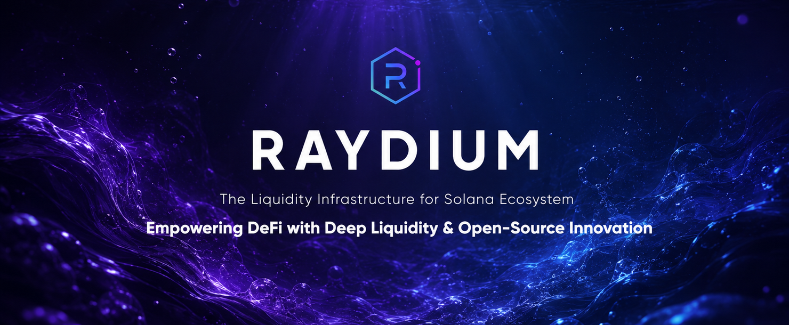

<div align="center">
  

  ### High-Performance Liquidity Infrastructure for DeFi on Solana

  <a href="https://raydium.io"></a>
  <a href="https://raydium.io/swap/"></a>
  <a href="https://raydium.io/pools/"></a>
  <a href="https://docs.raydium.io"></a>

  <br/>

  <a href="https://twitter.com/raydium"></a>
  <a href="https://discord.gg/raydium"></a>
  <a href="https://t.me/raydiumprotocol"></a>
  <a href="https://github.com/raydium-io"></a>
</div>

---

## 📖 About Raydium

Raydium is a leading AMM, DEX, and liquidity infrastructure protocol built on Solana. It provides high-performance liquidity primitives for swaps, liquidity provision, token launches, and developer integrations across the Solana DeFi ecosystem.

Raydium’s public GitHub organization hosts selected protocol repositories, SDKs, IDLs, examples, documentation, and integration resources for developers building on top of Raydium.

<br/>

<table align="center">
<tr>
<td width="33%">

### ⚡ High Performance
Built on Solana for fast execution, low fees, and high-throughput DeFi activity.

</td>
<td width="33%">

### 💧 Multi-Pool Liquidity
Supports concentrated liquidity, constant-product liquidity, and legacy AMM pool models.

</td>
<td width="33%">

### 🚀 Launch & Ecosystem Primitives
Powers token launch flows, liquidity bootstrapping, routing, rewards, and integrations.

</td>
</tr>
<tr>
<td width="33%">

### 🧰 Public Developer Resources
Selected protocol code, SDKs, IDLs, examples, and documentation for builders.

</td>
<td width="33%">

### 🧩 Composable by Design
Built for integrations through SDKs, CPI examples, program interfaces, and on-chain liquidity.

</td>
<td width="33%">

### 🌐 Ecosystem-Focused
Designed for traders, liquidity providers, token teams, protocols, wallets, and developers.

</td>
</tr>
</table>

---

## 🗺️ Raydium Project Overview

> A quick map of the main Raydium primitives and where developers can start.

<table>
<thead>
<tr>
<th align="left">Area</th>
<th align="left">What it Covers</th>
<th align="left">Start Here</th>
</tr>
</thead>
<tbody>
<tr>
<td align="left"><strong>CLMM</strong></td>
<td align="left">Concentrated liquidity pools where LPs provide liquidity within custom price ranges.</td>
<td align="left"><a href="https://github.com/raydium-io/raydium-clmm">raydium-clmm</a></td>
</tr>
<tr>
<td align="left"><strong>CPMM / CP-Swap</strong></td>
<td align="left">Revamped constant-product pools with no OpenBook market requirement and Token-2022 support.</td>
<td align="left"><a href="https://github.com/raydium-io/raydium-cp-swap">raydium-cp-swap</a></td>
</tr>
<tr>
<td align="left"><strong>AMM</strong></td>
<td align="left">Legacy constant-product AMM program and historical liquidity infrastructure.</td>
<td align="left"><a href="https://github.com/raydium-io/raydium-amm">raydium-amm</a></td>
</tr>
<tr>
<td align="left"><strong>Launch & Ecosystem Products</strong></td>
<td align="left">Token launch, liquidity bootstrapping, rewards, routing, and ecosystem integrations.</td>
<td align="left"><a href="https://docs.raydium.io">Raydium Docs</a> · <a href="https://github.com/raydium-io/raydium-sdk-V2">SDK V2</a> · <a href="https://github.com/raydium-io/raydium-idl">IDLs</a></td>
</tr>
<tr>
<td align="left"><strong>SDK & API Integration</strong></td>
<td align="left">TypeScript tools for swaps, pool discovery, liquidity actions, token data, and transaction building.</td>
<td align="left"><a href="https://github.com/raydium-io/raydium-sdk-V2">raydium-sdk-V2</a> · <a href="https://github.com/raydium-io/raydium-sdk-V2-demo">raydium-sdk-V2-demo</a></td>
</tr>
<tr>
<td align="left"><strong>IDL & CPI Integration</strong></td>
<td align="left">Program interfaces and examples for composing with Raydium from other Solana programs.</td>
<td align="left"><a href="https://github.com/raydium-io/raydium-idl">raydium-idl</a> · <a href="https://github.com/raydium-io/raydium-cpi-example">raydium-cpi-example</a> · <a href="https://github.com/raydium-io/raydium-cpi">raydium-cpi</a></td>
</tr>
<tr>
<td align="left"><strong>Rust Helpers & CLI</strong></td>
<td align="left">Rust helper libraries and command-line tools for constructing and interacting with Raydium instructions.</td>
<td align="left"><a href="https://github.com/raydium-io/raydium-library">raydium-library</a> · <a href="https://github.com/raydium-io/raydium-contract-instructions">raydium-contract-instructions</a></td>
</tr>
<tr>
<td align="left"><strong>Docs & Frontend Resources</strong></td>
<td align="left">Developer documentation, UI resources, and user-facing integration references.</td>
<td align="left"><a href="https://github.com/raydium-io/raydium-docs-v1">raydium-docs-v1</a> · <a href="https://github.com/raydium-io/raydium-ui-v3-public">raydium-ui-v3-public</a></td>
</tr>
</tbody>
</table>

---

## 🔗 Core Protocol Repositories

> Selected on-chain Rust programs powering Raydium liquidity.

<table>
<thead>
<tr>
<th align="left">Repository</th>
<th align="left">Description</th>
<th align="center">Language</th>
<th align="center">Status</th>
</tr>
</thead>
<tbody>
<tr>
<td align="left"><a href="https://github.com/raydium-io/raydium-clmm">raydium-clmm 🔗</a></td>
<td align="left">Concentrated Liquidity Market Maker program for capital-efficient liquidity ranges.</td>
<td align="center"></td>
<td align="center"></td>
</tr>
<tr>
<td align="left"><a href="https://github.com/raydium-io/raydium-cp-swap">raydium-cp-swap 🔗</a></td>
<td align="left">Revamped constant-product AMM with Token-2022 support and no OpenBook market requirement.</td>
<td align="center"></td>
<td align="center"></td>
</tr>
<tr>
<td align="left"><a href="https://github.com/raydium-io/raydium-amm">raydium-amm 🔗</a></td>
<td align="left">Legacy constant-product AMM repository and historical AMM infrastructure.</td>
<td align="center"></td>
<td align="center"></td>
</tr>
</tbody>
</table>

---

## 🧰 SDK, IDLs & Developer Tools

> Everything you need to build on Raydium — SDKs, IDLs, CPI examples, and helper libraries.

<table>
<thead>
<tr>
<th align="left">Repository</th>
<th align="left">Description</th>
<th align="center">Language</th>
<th align="center">Status</th>
</tr>
</thead>
<tbody>
<tr>
<td align="left"><a href="https://github.com/raydium-io/raydium-sdk-V2">raydium-sdk-V2 🔗</a></td>
<td align="left">TypeScript SDK for building applications and integrations on top of Raydium.</td>
<td align="center"></td>
<td align="center"></td>
</tr>
<tr>
<td align="left"><a href="https://github.com/raydium-io/raydium-sdk-V2-demo">raydium-sdk-V2-demo 🔗</a></td>
<td align="left">Runnable SDK V2 examples for swaps, pools, liquidity actions, and common integration flows.</td>
<td align="center"></td>
<td align="center"></td>
</tr>
<tr>
<td align="left"><a href="https://github.com/raydium-io/raydium-idl">raydium-idl 🔗</a></td>
<td align="left">IDL files for Raydium programs, useful for clients, tooling, and program integrations.</td>
<td align="center"></td>
<td align="center"></td>
</tr>
<tr>
<td align="left"><a href="https://github.com/raydium-io/raydium-cpi-example">raydium-cpi-example 🔗</a></td>
<td align="left">CPI examples for integrating with Raydium AMM, CP-Swap, and CLMM programs.</td>
<td align="center"></td>
<td align="center"></td>
</tr>
<tr>
<td align="left"><a href="https://github.com/raydium-io/raydium-cpi">raydium-cpi 🔗</a></td>
<td align="left">Rust CPI helper crate and interface resources for calling Raydium programs from other programs.</td>
<td align="center"></td>
<td align="center"></td>
</tr>
<tr>
<td align="left"><a href="https://github.com/raydium-io/raydium-library">raydium-library 🔗</a></td>
<td align="left">Rust helper library and CLI resources for interacting with Raydium contracts.</td>
<td align="center"></td>
<td align="center"></td>
</tr>
<tr>
<td align="left"><a href="https://github.com/raydium-io/raydium-contract-instructions">raydium-contract-instructions 🔗</a></td>
<td align="left">Instruction-building helpers and examples for interacting with Raydium contracts.</td>
<td align="center"></td>
<td align="center"></td>
</tr>
</tbody>
</table>

---

## 📚 Documentation & Frontend Resources

<table>
<thead>
<tr>
<th align="left">Repository</th>
<th align="left">Description</th>
<th align="center">Language</th>
<th align="center">Status</th>
</tr>
</thead>
<tbody>
<tr>
<td align="left"><a href="https://github.com/raydium-io/raydium-docs-v1">raydium-docs-v1 🔗</a></td>
<td align="left">Raydium documentation content for developers, integrators, and users.</td>
<td align="center"></td>
<td align="center"></td>
</tr>
<tr>
<td align="left"><a href="https://github.com/raydium-io/raydium-docs">raydium-docs 🔗</a></td>
<td align="left">Historical documentation and reference materials.</td>
<td align="center"></td>
<td align="center"></td>
</tr>
<tr>
<td align="left"><a href="https://github.com/raydium-io/raydium-ui-v3-public">raydium-ui-v3-public 🔗</a></td>
<td align="left">Public frontend resources for Raydium UI v3.</td>
<td align="center"></td>
<td align="center"></td>
</tr>
</tbody>
</table>

---

## 🚀 Quick Start

> Get started with the Raydium SDK in seconds.

**Install the latest SDK:**

```bash
npm install @raydium-io/raydium-sdk-v2
```

**Initialize and fetch pool info:**

```typescript
import { Connection, Keypair } from "@solana/web3.js";
import { Raydium } from "@raydium-io/raydium-sdk-v2";

// Initialize the SDK
const connection = new Connection("https://api.mainnet-beta.solana.com");
const raydium = await Raydium.load({
  connection,
  owner: Keypair.fromSecretKey(/* your secret key */),
  cluster: "mainnet",
});

// Fetch pool info by id
const pools = await raydium.api.fetchPoolById({ ids: poolId });
console.log(pools[0]);
```

> For full swap, pool, and liquidity examples, see the [raydium-sdk-V2-demo](https://github.com/raydium-io/raydium-sdk-V2-demo) repository.

---

## 📊 Repository Map

<div align="center">

| | | |
|:---:|:---:|:---:|
| 📦 **Public Repositories** | 🛠 **Developer Resources** | 🌐 **Solana DeFi Infrastructure** |
| Selected protocol code, SDKs, IDLs, docs & examples | Rust · TypeScript · MDX · IDL | CLMM · CPMM · AMM · Launch · Integrations |

</div>

---

## 🔐 Security

If you believe you have found a security issue, please follow Raydium’s official security reporting process and avoid disclosing details publicly before the issue has been reviewed.

<div align="center">

<a href="https://immunefi.com/bounty/raydium"></a>

</div>

---

## 🌍 Community

<div align="center">

| | | |
|:---:|:---:|:---:|
| 🐦 [**Twitter**](https://twitter.com/raydium) | 💬 [**Discord**](https://discord.gg/raydium) | ✈️ [**Telegram**](https://t.me/raydiumprotocol) |
| Latest announcements | Developer support & chat | Community discussion |

<br/>

| | |
|:---:|:---:|
| 📖 [**Documentation**](https://docs.raydium.io) | 🌐 [**Website**](https://raydium.io) |
| Technical docs | Trade on Raydium |

</div>

---

<div align="center">

  

  **Built with 💚 by the Raydium Team**

  <sub>Raydium publishes selected public repositories and developer resources for the Solana DeFi ecosystem.</sub>

  <br/>

  <a href="https://raydium.io"></a>
  <a href="https://docs.raydium.io"></a>

</div>
